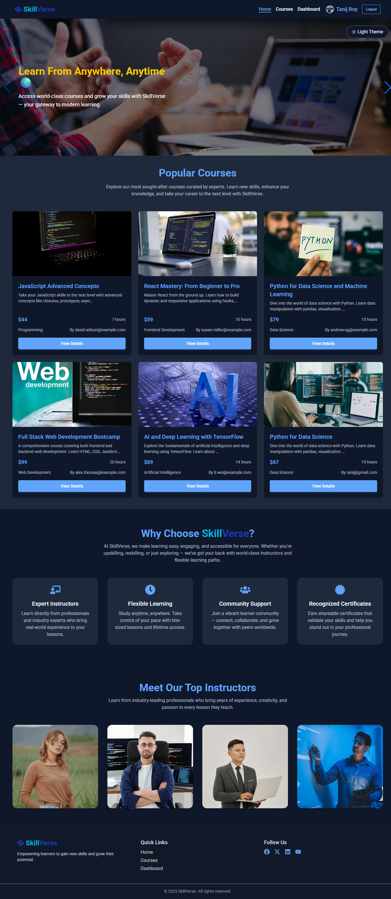

# 🎓 SkillVerse – Explore & Learn Your Favorite Courses





## 🧩 Description

**SkillVerse** is a responsive React application where users can explore various online courses, view detailed course information, read reviews, and enroll in courses.  
It supports dynamic course browsing, filtering, rating, carousel sliders, and interactive notifications.

## 🚀 Live Demo

- **Frontend:** 🔗 [View Deployed App](https://skillverse-client-b12a10.netlify.app)  
- **Backend:** 🔗 [View Backend API](https://skillverse-server.vercel.app)

## 💡 Features

- Browse, and filter courses across multiple categories like Programming, Data Science, Design, and more.
- View detailed course information, including description, instructor, duration, and enrolled learners.
- Add reviews and ratings for courses.
- Responsive carousel for featured courses using Swiper.js.
- Interactive toast notifications with Hot Toast.
- Sweet Alert pop-ups for enrollment confirmation and other actions.
- Animated elements with AOS and Animate.css for smooth UX.
- Firebase authentication and Firestore integration for user management.

## 🧰 Technologies Used

| Technology           | Purpose                        |
| -------------------- | ------------------------------ |
| **React.js**         | Frontend framework             |
| **React Router**     | Routing and navigation         |
| **Tailwind CSS**     | Styling                        |
| **DaisyUI**          | Pre-styled UI components       |
| **React Icons**      | Icons for UI elements          |
| **Swiper.js**        | Carousel sliders               |
| **Hot Toast**        | Toast notifications            |
| **Sweet Alert**      | Pop-up alerts                  |
| **AOS & Animate.css**| Animations                     |
| **Recharts**         | Data visualization             |
| **Axios**            | API requests                   |
| **Firebase**         | Authentication & Firestore     |
| **Spinners React**   | Loading indicators             |


## ⚙️ Installation & Local Setup
### Frontend Setup

1. Clone the frontend repository:
```js
git clone https://github.com/TanijRoy1/skillverse-client-b12a10.git
```

2. Navigate to the project folder:
```js
cd skillverse-client-b12a10
```

3. Install dependencies:
```js
npm install
```

4. Create a `.env` file in the root and add Firebase config.

5. Start the development server:
```js
npm run dev
```

6. The app will run on http://localhost:5173

### Backend Setup

1. Clone the backend repository:
```js
git clone https://github.com/TanijRoy1/skillverse-server-b12a10.git
```

2. Navigate to the backend folder:
```js
cd skillverse-server-b12a10
```

3. Install dependencies:
```js
npm install
```

4. Create a `.env` file in the backend root and add MongoDB credentials and Firebase service account keys.


5. Start the backend server:
```js
nodemon index.js
```

6. Backend API will run on http://localhost:3000

## 💻 Project Flow

- Frontend interacts with backend APIs using Axios.

- Firebase handles authentication and Firestore for storing user and course data.

- Users can browse, enroll, and rate courses seamlessly.

## 💡 Author

👤 **Tanij Roy**  
🔗 [GitHub Profile](https://github.com/TanijRoy1)

---

